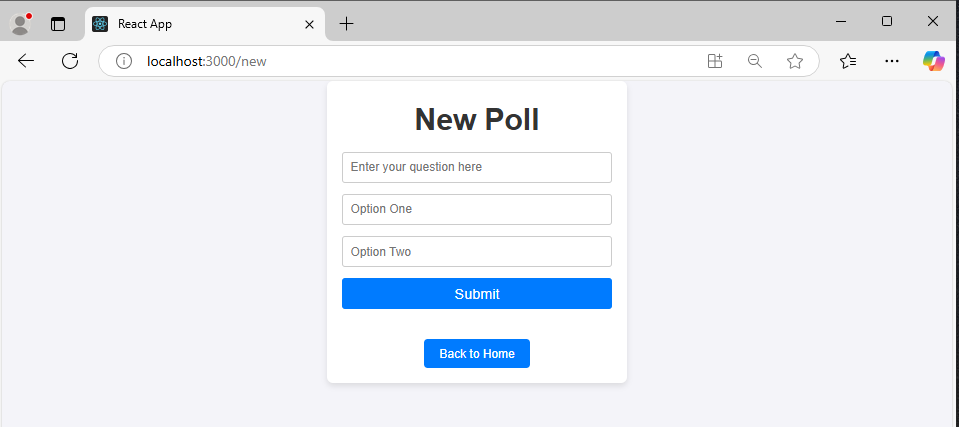

# Employee Polls App

### Description
Employee Polls App is an interactive platform built with React, Redux, and Jest. 
It allows users to create, vote on, and view polls, with features
like leaderboards and dashboards to enhance engagement.

**IMPORTANT NOTE:**
Please Turn On THIRD-PARTY Cookies on Google Chrome or keep The tracking preventation At Basic in Microsoft Edge, to compile the App without any ERRORS, also dont forget to clear your Browser History.
Thanks.

### Features
**Authentication:** Secure login system for users.
**Dashboard:** View answered and unanswered polls.
**Create Polls:** Easily create polls with two options.
**Vote on Polls:** Submit votes and see results immediately.
**Leaderboard:** Tracks users' performance based on created and answered polls.
**Responsive Design:** Optimized for various devices.

---

## Installation and Setup Instructions

### Clone the repository:
git clone https://github.com/hazaaAlmarzooqi/PollVotes.git
cd PollVotes

### Install dependencies:
To install all the required dependencies for the project, use
**npm install**

### Running the Application

To run the development server locally:
**npm start**

Once the development server starts, open your browser and navigate to:
**http://localhost:3000**


## What You're Getting

```bash
src/
├── actions/            # Redux action creators
├── components/         # React components (Dashboard, Leaderboard, Poll, etc.)
├── reducers/           # Redux reducers
├── utils/              # Utility functions (_DATA.js)
├── App.css             # Global styles
├── App.js              # Main app component
├── store.js            # Redux store configuration
```    
---

## Usage

**- Login:**
    Select a user from the dropdown menu.
    Login to access the dashboard.

**- Dashboard:**
    View unanswered and answered polls.
    Click "View Poll" to vote or see results.

**- Create Poll:**
    Enter a question and two options.
    Submit to add it to the dashboard.

**- Leaderboard:**
    Track users based on polls created and answered.

---

## Technologies Used

- **React:** Frontend framework.
- **Redux:** State management.
- **React Router:** Routing for navigation.
- **React Toastify:** User notifications.
- **Jest:** Unit testing.
- **CSS:** Styling.

---

## Screenshots

Here you can add some screenshots of the app for visual reference:

- **Login page**:


- **Home Page**:


- **Dashboard Page**:


- **Leaderboard Page**:


- **New Poll Page**:


---

## Contact

If you have any questions or suggestions, feel free to contact me:
- Email: hazza3.ae12@gmail.com
- GitHub: [hazaaAlmarzooqi](https://github.com/hazaaAlmarzooqi)
